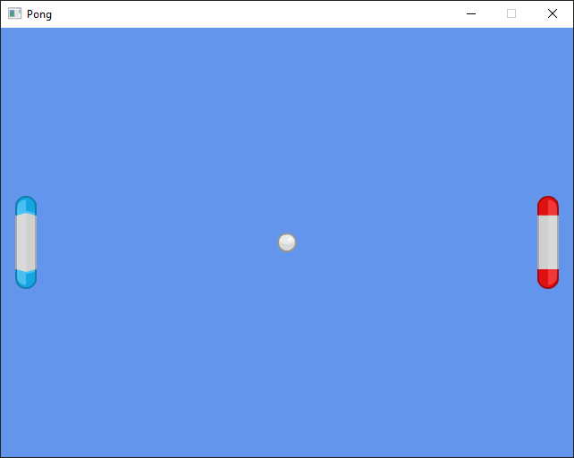

# Pong Backroll

Experimenting with https://github.com/HouraiTeahouse/backroll-rs to learn more about rollback networking.

Pong was made by following the Tetra tutorial. Tetra is a 2D game framework with a deterministic game loop for Rust.

https://tetra.seventeencups.net/tutorial

## Build & Run

With Rust [installed and setup](https://www.rust-lang.org/learn/get-started), clone this repo and run:

 `cargo run`.